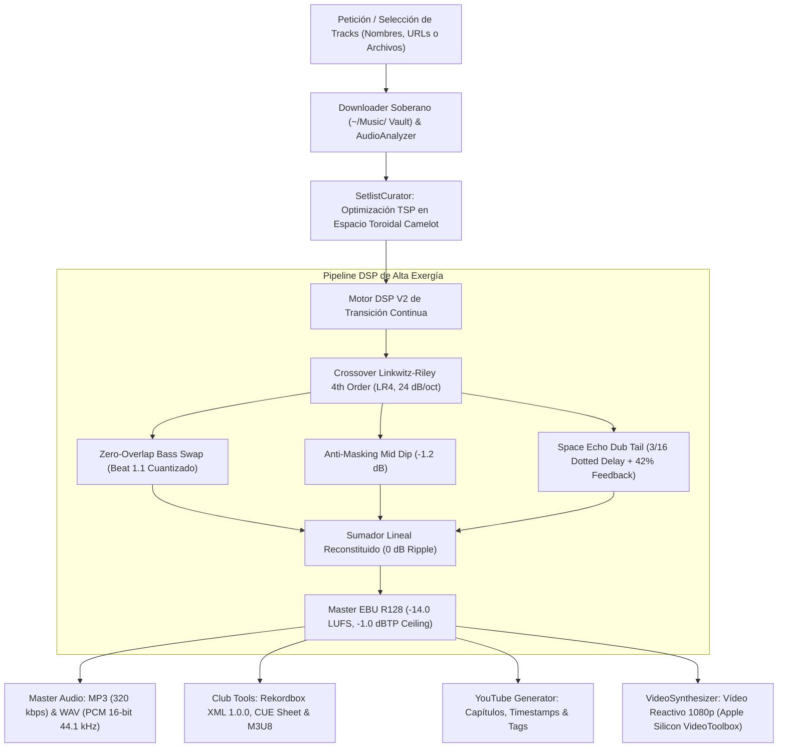

# COMPUTERS AFTER ALL

> **Sistema de DJ Autónomo & Sintetizador de Vídeo Reactivo para YouTube**  
> *Homage: Daft Punk «Human After All» $\longrightarrow$ «Computers After All»*  
> *Framework Epistémico C5-REAL · Alta Exergía · Invariantes de Silicio*

[](https://github.com/borjamoskv/computers-after-all/actions)
[](https://www.python.org/)
[](https://opensource.org/licenses/MIT)
[-00ffcc.svg)](https://tech.ebu.ch/publications/r128)
[]()

---

## 1. Visión & Arquitectura

**Computers After All** es un sistema autónomo de DJ que transforma una lista de nombres de tracks, búsquedas o archivos locales en:
1. Una **sesión continua de club de grado master** mezclada con precisión matemática (sin solapamiento destructivo de graves).
2. Un **vídeo reactivo 1080p para YouTube** con analizador de espectro de frecuencias en tiempo real, osciloscopio de forma de onda, HUD Cyber Noir con tarjetas dinámicas de track activo y metadatos armónicos Camelot.
3. El paquete completo de **herramientas de cabina profesional**: archivo Pioneer Rekordbox XML (`DJ_PLAYLISTS 1.0.0`), partitura CUE, lista M3U8 y descripción con capítulos formateados para YouTube Studio.



---

## 2. Invariantes de Mezcla y Física Psicoacústica

El error endémico de los mezcladores automáticos y crossfaders genéricos es la suma indiscriminada de señales: dos bombos o líneas de subgrave solapadas durante 32 compases producen **cancelación de fase por peine (*comb filtering*)** y barro dinámico inaudible en club.

Computers After All erradica este fallo aplicando cuatro invariantes de silicio:

### 2.1. Crossover Linkwitz-Riley de 4º Orden (LR4)
* **Bandas:** Sub/Graves ($0-160\text{ Hz}$), Medios ($160-2800\text{ Hz}$), Agudos ($>2800\text{ Hz}$).
* **Pendiente Asintótica:** Dos filtros Butterworth de 2º orden en cascada procesados hacia adelante y hacia atrás (`scipy.signal.filtfilt`), resultando en una atenuación simétrica de $-24\text{ dB/octava}$.
* **Fase Plana y Ganancia Unitaria:** La suma de las tres bandas es matemáticamente exacta a ganancia $1.0$ ($0\text{ dB}$ de ripple y cero distorsión de fase).
* **Guarda de Silicio:** Filtro defensivo contra colapso por `padlen` en transitorios o silencios breves ($N < 30$ muestras).

### 2.2. Zero-Overlap Bass Swap (Cuantizado al Beat 1.1)
* El canal de bajas frecuencias ($0-160\text{ Hz}$) de la pista saliente conmuta a $-\infty\text{ dB}$ en el beat 1 exacto del compás de relevo (ej. compás 16 de una transición de 32 compases).
* La pista entrante abre su subgrave en ese mismo instante.
* Una micro-rampa de 128 muestras ($\approx 2.9\text{ ms}$) elimina clics por discontinuidad de corriente continua (DC).

### 2.3. Dip Psicoacústico de Medios (-1.2 dB)
* Durante el punto central del crossfade de medios ($t = 0.5$), se aplica una curva convexa de atenuación de $-1.2\text{ dB}$ que previene la fatiga coclear y el enmascaramiento mutuo de cajas y sintetizadores.

### 2.4. Space Echo Dub Tail (Delay con Puntillo 3/16)
* En transiciones atmosféricas o de ruptura, los medios y agudos del track saliente se inyectan en una línea de retardo tape delay sincronizada a corchea con puntillo:
  $$T_{\text{delay}} = \frac{60}{\text{BPM}} \times 0.75\text{ s}$$
* Realimentación amortiguada al $42\%$ con filtro pasa-bajos de un polo y decaimiento natural de 8 a 10 segundos.

---

## 3. Instalación

### Requisitos Previos
* **Python:** 3.10 o superior.
* **FFmpeg:** Versión 6.0+ (en macOS Apple Silicon aprovecha automáticamente la aceleración por hardware `h264_videotoolbox`).
* **yt-dlp:** Opcional (para descargar tracks por nombre o URL).

### Instalación vía pip
```bash
git clone https://github.com/borjamoskv/computers-after-all.git
cd computers-after-all
pip install -e .
```

---

## 4. Uso Rápido desde Terminal (CLI)

### Caso 1: Decirle qué tracks quieres (Búsqueda y Mezcla Automática)
Le indicas los nombres de las pistas deseadas; el sistema las descarga en máxima calidad, las analiza, las ordena armónicamente, las mezcla y sintetiza el vídeo de YouTube:
```bash
computers-after-all mix \
  -t "Shed - Boom Room" \
  -t "Kassem Mosse - Enoha" \
  -t "Donato Dozzy - Terzo Giorno" \
  --title "DARK_CYBER_TRILOGY" \
  --bars 32 \
  --video
```

### Caso 2: Mezclar una carpeta de audio local
```bash
computers-after-all mix \
  --dir ~/Music/UndergroundTechno \
  --bars 64 \
  --title "BERLIN_WALL_OF_SOUND_MIX" \
  --out ~/Music/MiSesion
```

### Caso 3: Analizar una pista (BPM, Clave Camelot y Puntos Cue)
```bash
computers-after-all analyze "01 - Track.mp3"
```
Salida en terminal:
```text
🎧 Track Analysis: Shed - Boom Room
   • Duration:    384.2 s
   • BPM:         128.0
   • Camelot Key: 11A (F#m)
   • Energy:      0.82
   • Cue Points:
     [0] Intro: 0.00 s
     [1] Mix In: 15.00 s
     [2] Bass Swap: 45.00 s
     [3] Mix Out: 320.00 s
```

---

## 5. Salidas Generadas (Artifacts de Cabina)

Por defecto, todos los activos se centralizan ordenadamente en `~/Music/Computers After All Exports/<TITLE>/`:

1. **`*.mp3`:** Master a 320 kbps codificado con `libmp3lame`.
2. **`*.wav`:** Master sin pérdidas PCM 16-bit 44.1 kHz, calibrado a **-14.0 LUFS EBU R128**.
3. **`*_VIDEO.mp4`:** Vídeo 1080p a 30/60 fps con analizador de espectro de frecuencias animado, osciloscopio y HUD con el nombre de cada pista, clave Camelot y BPM.
4. **`*_THUMBNAIL.png`:** Miniatura de 1280x720 en estética Dark Cyber con el tracklist resumido y la información técnica.
5. **`*_REKORDBOX.xml`:** Archivo oficial Pioneer Rekordbox XML (`DJ_PLAYLISTS 1.0.0`) listo para importar en CDJ-3000, XDJ-XZ, Engine DJ o DJ.Studio.
6. **`*.cue`:** Partitura de corte con tiempos `INDEX 01` exactos.
7. **`*.m3u8`:** Lista de reproducción extendida UTF-8.
8. **`*_YOUTUBE_METADATA.md`:** Título optimizado, capítulos con minutaje exacto y etiquetas SEO listas para copiar y pegar en YouTube Studio.

---

## 6. Uso como Biblioteca Python

```python
from pathlib import Path
from computers_after_all import AutonomousDJ, VideoSynthesizer, VideoConfig, ClubExporter

# 1. Instanciar el DJ Autónomo con transición de 32 compases
dj = AutonomousDJ(default_transition_bars=32)

# 2. Planificar el setlist (análisis + recocido simulado Camelot)
tracks = [Path("track1.mp3"), Path("track2.mp3"), Path("track3.mp3")]
plan = dj.prepare_set(tracks, optimize_order=True)

# 3. Renderizar audio master continuo (WAV & MP3 EBU R128)
out_dir = Path("~/Music/MySet").expanduser()
mp3_path, wav_path = dj.render_mix(plan, output_dir=out_dir, mix_title="BERLIN_SESSION")

# 4. Exportar a Pioneer Rekordbox XML
exporter = ClubExporter()
exporter.export_rekordbox_xml(plan, out_dir / "BERLIN_SESSION.xml")

# 5. Sintetizar vídeo reactivo para YouTube
synthesizer = VideoSynthesizer(config=VideoConfig(width=1920, height=1080, fps=30))
video_path = synthesizer.render_youtube_video(
    audio_path=mp3_path,
    plan=plan,
    output_video_path=out_dir / "BERLIN_SESSION_VIDEO.mp4"
)
```

---

## 7. Ejecutar Pruebas Automatizadas

```bash
pytest tests/ -v
```

El repositorio incluye 15 pruebas unitarias exhaustivas que certifican la respuesta en frecuencia del crossover Linkwitz-Riley, la invariante de fase plana, el corte asimétrico de graves, la distancia toroidal Camelot, la estructura del XML de Rekordbox y la renderización de overlays gráficos.

---

## 8. Licencia

Licencia MIT. Desarrollado por **Borja (`borjamoskv`)**.
Soberanía digital, física de la información y rigor termodinámico.
